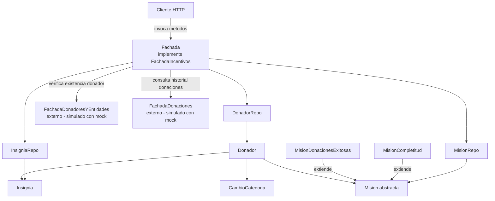
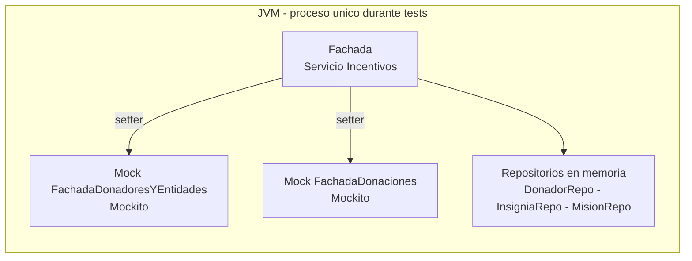
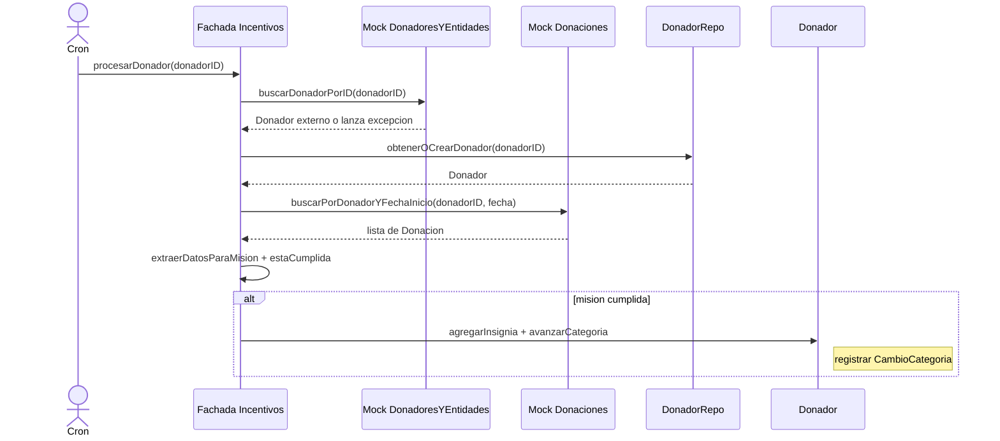

# Diagrama de Arquitectura – Servicio de Incentivos – Entrega 1

## Diagrama de Componentes

---

## Diagrama de Despliegue

> No hay base de datos ni persistencia en disco. Los repos usan listas en memoria siguiendo el patron Repository. Se reemplazara con persistencia real en entregas posteriores.

---

## Interacciones simuladas

| Origen | Destino | Operacion | Como se simula |
|---|---|---|---|
| Incentivos | Donadores y Entidades | buscarDonadorPorID | Mock Mockito |
| Incentivos | Donaciones | buscarPorDonadorYFechaInicio | Mock Mockito |

---

## Flujo principal: procesarDonador

