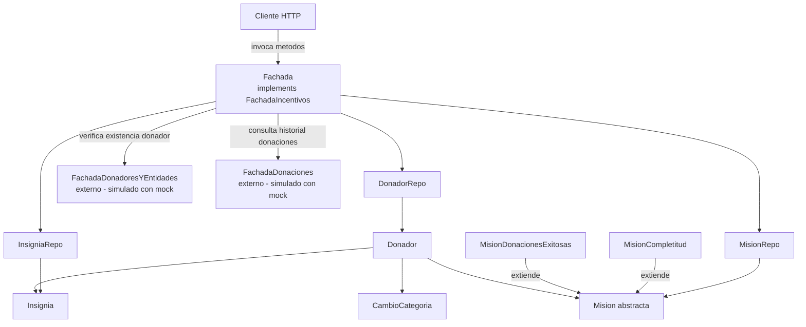
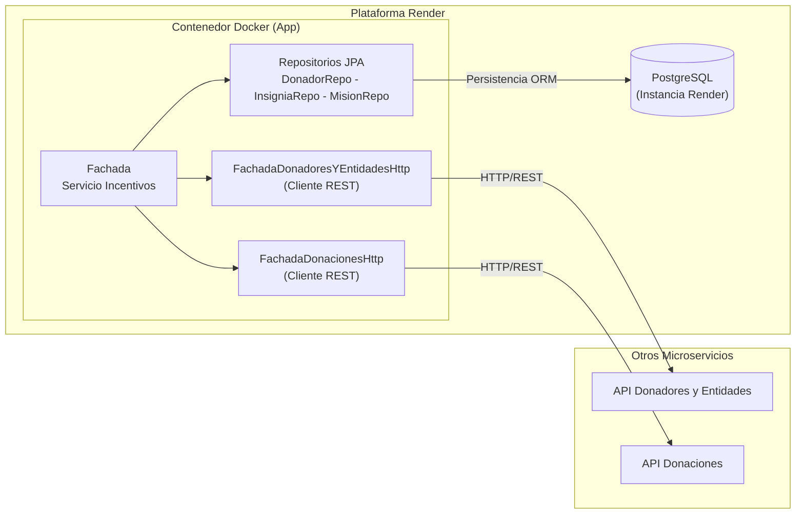
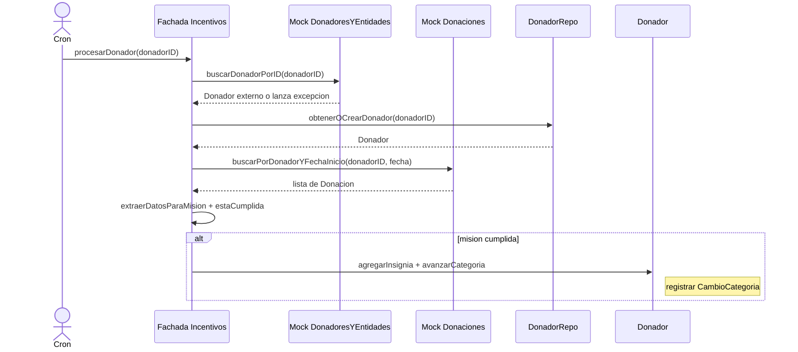

# Diagrama de Arquitectura – Servicio de Incentivos – Entrega 1

## Diagrama de Componentes

---

## Diagrama de Despliegue

> Nota de Arquitectura: En esta entrega se migró la persistencia en memoria hacia una base de datos relacional PostgreSQL desplegada en Render, utilizando Spring Data JPA como ORM. Además, las integraciones simuladas fueron reemplazadas por clientes HTTP (utilizando HttpClient nativo de Java 11+) para comunicarse de forma sincrónica con las APIs reales del resto del equipo.

---

## Interacciones simuladas

| Origen | Destino | Operacion | Como se simula |
|---|---|---|---|
| Incentivos | Donadores y Entidades | buscarDonadorPorID | Mock Mockito |
| Incentivos | Donaciones | buscarPorDonadorYFechaInicio | Mock Mockito |

---

## Flujo principal: procesarDonador

