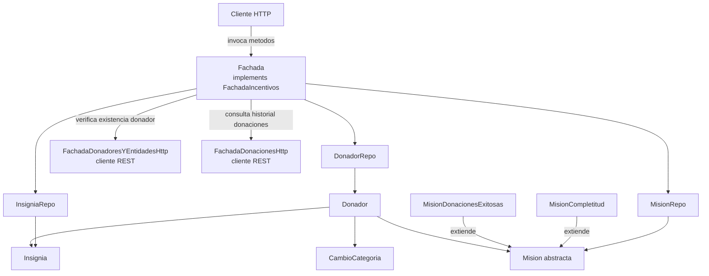
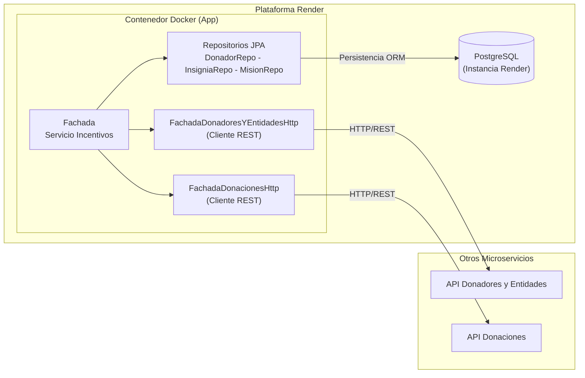
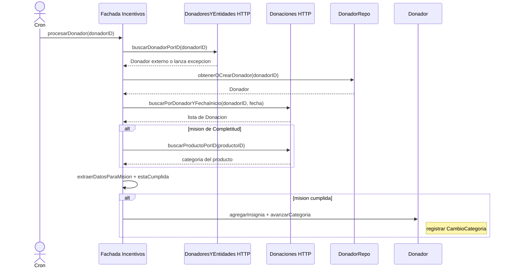

# Diagrama de Arquitectura – Servicio de Incentivos – Entrega 3

## Diagrama de Componentes

```mermaid
graph TD
    C["Cliente HTTP"]

    FI["Fachada\nimplements FachadaIncentivos"]
    DR["DonadorRepo"]
    IR["InsigniaRepo"]
    MR["MisionRepo"]
    D["Donador"]
    CC["CambioCategoria"]
    INS["Insignia"]
    MA["Mision abstracta"]
    MC["MisionCompletitud"]
    MD["MisionDonacionesExitosas"]

    FDE["FachadaDonadoresYEntidadesHttp\ncliente REST"]
    FD["FachadaDonacionesHttp\ncliente REST"]

    C -->|invoca metodos| FI
    FI -->|verifica existencia donador| FDE
    FI -->|consulta historial donaciones| FD
    FI --> DR
    FI --> IR
    FI --> MR
    DR --> D
    IR --> INS
    MR --> MA
    MC -->|extiende| MA
    MD -->|extiende| MA
    D --> INS
    D --> MA
    D --> CC
```

---

## Diagrama de Despliegue

```mermaid
graph LR
    subgraph Render["Plataforma Render"]
        subgraph Docker["Contenedor Docker (App)"]
            FACHADA["Fachada\nServicio Incentivos"]
            MEM["Repositorios JPA\nDonadorRepo - InsigniaRepo - MisionRepo"]
            HTTP_DE["FachadaDonadoresYEntidadesHttp\n(Cliente REST)"]
            HTTP_DON["FachadaDonacionesHttp\n(Cliente REST)"]
        end
        DB[("PostgreSQL\n(Instancia Render)")]
    end

    subgraph API_Companeros["Otros Microservicios"]
        API_DE["API Donadores y Entidades"]
        API_DON["API Donaciones"]
    end

    FACHADA --> MEM
    MEM -->|Persistencia ORM| DB
    FACHADA --> HTTP_DE
    FACHADA --> HTTP_DON
    HTTP_DE -->|HTTP/REST| API_DE
    HTTP_DON -->|HTTP/REST| API_DON
```
> Nota de Arquitectura: La persistencia se realiza en una base de datos relacional PostgreSQL desplegada en Render, utilizando Spring Data JPA como ORM. El componente consume mediante clientes HTTP (utilizando HttpClient nativo de Java 11+) las APIs reales necesarias de Donadores y Entidades y Donaciones.

> **Responsabilidad de estadísticas:** las estadísticas del sistema son responsabilidad del componente de Donaciones y Entidades. Incentivos no calcula ni administra estadísticas; únicamente consulta el historial de donaciones y los datos del donador que necesita para evaluar misiones, asignar insignias y actualizar categorías. Las métricas `incentivos.*` mencionadas en este proyecto son métricas técnicas y de negocio para observabilidad del propio componente, no estadísticas generales del sistema.

---

## Interacciones externas reales

| Origen | Destino | Operacion | Como se simula |
|---|---|---|---|
| Incentivos | Donadores y Entidades | buscarDonadorPorID | HTTP GET |
| Incentivos | Donadores y Entidades | modifcarCategoria | HTTP PATCH |
| Incentivos | Donaciones | buscarPorDonadorYFechaInicio | HTTP GET |
| Incentivos | Donaciones | buscarProductoPorID | HTTP GET |

---

## Flujo principal: procesarDonador

```mermaid
sequenceDiagram
    actor Cron
    participant F as Fachada Incentivos
    participant DE as DonadoresYEntidades HTTP
    participant DON as Donaciones HTTP
    participant DR as DonadorRepo
    participant D as Donador

    Cron->>F: procesarDonador(donadorID)
    F->>DE: buscarDonadorPorID(donadorID)
    DE-->>F: Donador externo o lanza excepcion
    F->>DR: obtenerOCrearDonador(donadorID)
    DR-->>F: Donador
    F->>DON: buscarPorDonadorYFechaInicio(donadorID, fecha)
    DON-->>F: lista de Donacion
    alt mision de Completitud
        F->>DON: buscarProductoPorID(productoID)
        DON-->>F: categoria del producto
    end
    F->>F: extraerDatosParaMision + estaCumplida
    alt mision cumplida
        F->>D: agregarInsignia + avanzarCategoria
        Note right of D: registrar CambioCategoria
    end
```
