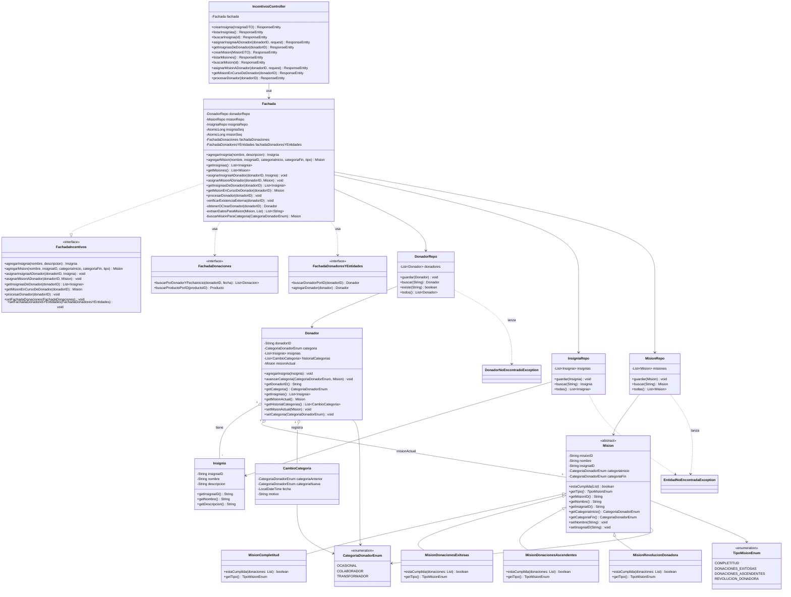

# 📊 Diagrama de Clases – Entrega 2 - Componente Incentivos

## Descripción General

El componente de Incentivos del TP de DDSI gestiona insignias (reconocimientos) y misiones (objetivos) para donadores. Las misiones evalúan el cumplimiento según diferentes criterios y permiten que los donadores avancen de categoría.

---

## Diagrama de Clases UML



---

## Descripciones de Clases

### Interfaz Principal (Cátedra)
| Clase | Responsabilidad |
|-------|-----------------|
| **FachadaIncentivos** | Contrato que define las operaciones del componente de Incentivos |

### Interfaces Externas (Cátedra)
| Clase | Responsabilidad |
|-------|-----------------|
| **FachadaDonaciones** | Acceso a datos de donaciones de otros componentes |
| **FachadaDonadoresYEntidades** | Acceso a datos de donadores y entidades |

### Fachada (Núcleo del Componente)
| Clase | Responsabilidad |
|-------|-----------------|
| **Fachada** | Orquesta operaciones del componente. Coordina repositorios locales e interfaces externas |

### Dominio - Insignias
| Clase | Responsabilidad |
|-------|-----------------|
| **Insignia** | Entidad de dominio que representa un reconocimiento |

### Dominio - Misiones
| Clase | Responsabilidad |
|-------|-----------------|
| **Mision** | Clase abstracta que define el contrato de una misión |
| **MisionCompletitud** | Donador debe donar de 3+ categorías diferentes |
| **MisionDonacionesExitosas** | Donador debe tener 20+ donaciones aceptadas |
| **MisionDonacionesAscendentes** | Donador debe realizar donaciones de cantidad ascendente |
| **MisionRevolucionDonadora** | Donador debe alcanzar volumen específico total |

### Dominio - Donador Local
| Clase | Responsabilidad |
|-------|-----------------|
| **Donador** | Entidad local que rastrea insignias, misión actual e historial de categorías |
| **CambioCategoria** | Registro de transiciones de categoría |

### Repositorios
| Clase | Responsabilidad |
|-------|-----------------|
| **DonadorRepo** | Persiste donadores locales en memoria |
| **InsigniaRepo** | Persiste insignias en memoria |
| **MisionRepo** | Persiste misiones en memoria |

### Controlador REST
| Clase | Responsabilidad |
|-------|-----------------|
| **IncentivosController** | Expone endpoints REST del componente |

### Excepciones
| Clase | Responsabilidad |
|-------|-----------------|
| **DonadorNoEncontradoException** | Lanzada cuando donador no existe |
| **EntidadNoEncontradaException** | Lanzada cuando insignia o misión no existe |

### Enumeraciones
| Clase | Valores |
|-------|--------|
| **CategoriaDonadorEnum** | OCASIONAL, COLABORADOR, TRANSFORMADOR |
| **TipoMisionEnum** | COMPLETITUD, DONACIONES_EXITOSAS, DONACIONES_ASCENDENTES, REVOLUCION_DONADORA |

---

## Flujos Principales

### 1. Crear Insignia
```
POST /insignias → Controller → Fachada.agregarInsignia() → InsigniaRepo
```

### 2. Asignar Insignia a Donador
```
POST /insignias/{donadorID}
→ Fachada.asignarInsigniaADonador()
→ Verifica existencia en FachadaDonadoresYEntidades
→ Obtiene/crea Donador local
→ Añade Insignia a Donador
```

### 3. Procesar Donador
```
POST /procesamiento/{donadorID}
→ Fachada.procesarDonador()
→ Obtiene Mision en curso
→ Consulta FachadaDonaciones
→ Evalúa Mision.estaCumplida()
→ Si cumplida: asigna insignia y avanza categoría
```

---

## Notas Importantes

- La entrega se centra **únicamente** en el componente de Incentivos
- No se modifican archivos en `/catedra`
- Los modelos locales (`Donador`, `Insignia`, `Mision`) persisten en memoria
- Las consultas de donadores externos usan `FachadaDonadoresYEntidades`
- Las consultas de donaciones externas usan `FachadaDonaciones`
